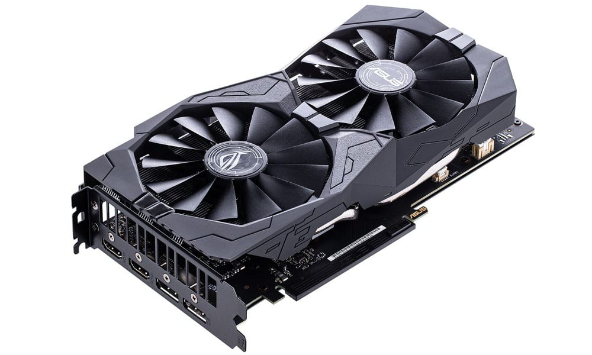
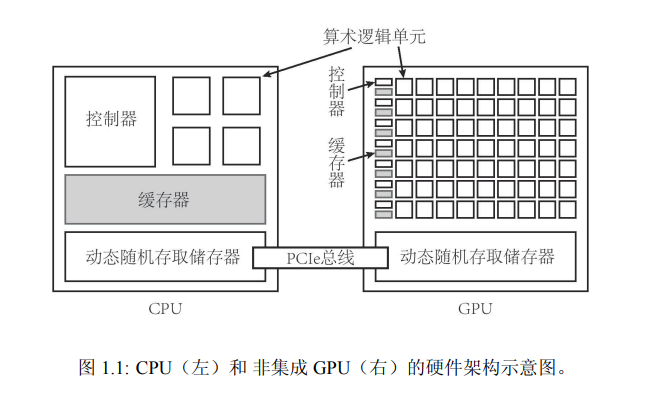
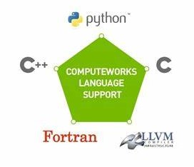
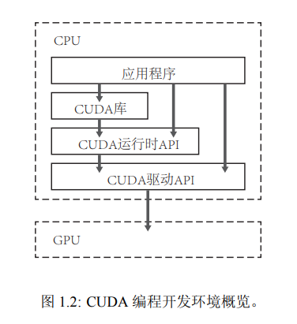

如果觉得文章及课程对您的学习起到帮助作用，请 ***Star*** 我的[github仓库](https://github.com/sangyc10/CUDA-code) ，并***关注***我的[B站频道](https://www.bilibili.com/video/BV1sM4y1x7of/):muscle::muscle::muscle:
>这一节是本课程的第一课，主要从概念上让大家了解什么是GPU、什么是CUDA。从今天开始，大家和我一起探索CUDA编程，一起学习努力、一起进步！！

# 一、GPU硬件平台

## 1、什么是GPU

GPU 意为图形处理器，也常被称为显卡，GPU最早主要是进行图形处理的。如今深度学习大火，GPU高效的并行计算能力充分被发掘，GPU在AI应用上大放异彩。GPU拥有更多的运算核心，其特别适合数据并行的计算密集型任务，如大型矩阵运算，与GPU对应的一个概念是CPU，但CPU的运算核心较少，但是其可以实现复杂的逻辑运算，因此其适合控制密集型任务，CPU更擅长数据缓存和流程控制。

## 2、GPU性能

主要GPU性能指标：

1. 核心数量：为GPU提供计算能力的硬件单元，核心数量越多，可并行运算的线程越多，计算的峰值越高；

2. GPU显存容量：显存容量决定着显存临时存储数据的多少，大显存能减少读取数据的次数，降低延迟，可类比CPU的内存；
3. GPU计算峰值：每块显卡都会给出显卡的GPU计算峰值，这是一个理论值，代表GPU的最大计算能力，一般实际运行是达不到这个数值的；
4. 显存带宽：GPU包含运算单元和显存，显存带宽就是运算单元和显存之间的通信速率，显存带宽越大，代表数据交换的速度越快，性能越高。

# 二、CPU+GPU异构架构

GPU不能单独进行工作，GPU相当于CPU的协处理器，由CPU进行调度。CPU+GPU组成异构计算架构，CPU的特点是更加擅长逻辑处理，而对大量数据的运算就不是那么擅长了，GPU恰好相反，GPU可以并行处理大量数据运算。

由这个图可以看出，一个典型的 CPU 拥 有少数几个快速的计算核心，而一个典型的 GPU 拥有几百到几千个不那么快速的计算核心。CPU 中有更多的晶体管用于数据缓存和流程控制，但 GPU 中有更多的晶体管用于算术逻辑单元。所以，GPU 是靠众多的计算核心来获得相对较高的计算性能的。

CPU和GPU都有自己的DRAM（dynamic random-access memory，动态随机存取内存），它们之间一般由PCIe总线（peripheral component interconnect express bus）连接。这里多说一点，PCIe总线上的数据传输速率相对来说是比较慢的，也就是说一个不那么复杂的任务，CPU和GPU数据传输的时间可能远远大于GPU计算的时间，所以在一些小型任务上，应用GPU也未必会起到加速作用。

在由 CPU 和 GPU 构成的异构计算平台中，通常将起控制作用的 CPU 称为主机（host），将起加速作用的 GPU 称为设备（device）。所以在今后，说到主机就是指CPU，说到设备就是指GPU。

# 三、CUDA介绍

这一小节从什么是CUDA、CUDA编程语言及CUDA运行时API三点进行阐述。

## 1、什么是CUDA

2006年11月，NVIDIA推出了CUDA，这是一种通用的并行计算平台和编程模型，利用NVIDIA GPU中的并行计算引擎，以比CPU更有效的方式解决许多复杂的计算问题。

CUDA是建立在NVIDIA的GPU上的一个通用并行计算平台和编程模型。

基于GPU的并行计算目前已经是深度学习训练的标配。

## 2、CUDA编程语言

说明：

1. CUDA旨在支持各种语言和应用程序编程接口；
2. 最初基于C语言，目前越来越多支持C++；
3. CUDA还支持Python编写；
4. 本课程主要基于C++的CUDA编程。

## 3、CUDA运行时API

说明：

1. CUDA提供两层API接口，CUDA驱动(driver)API和CUDA运行时(runtime)API；
2. 两种API调用性能几乎无差异，课程使用操作对用户更加友好Runtime API；
3. 本课程主要基于C++的CUDA编程

>好了，今天的内容就讲到这里，我会继续更新相关内容哦！！:muscle::muscle::muscle:
