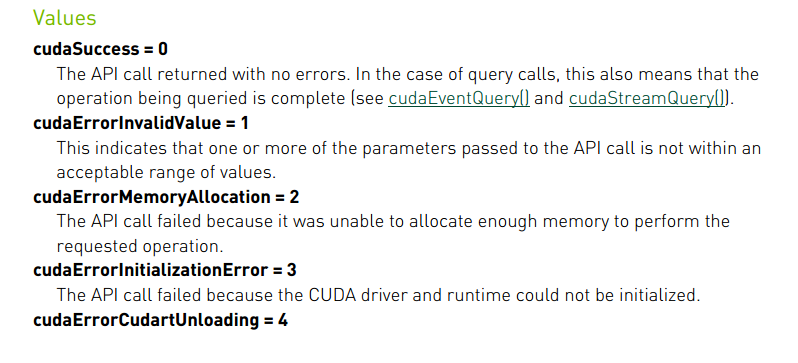
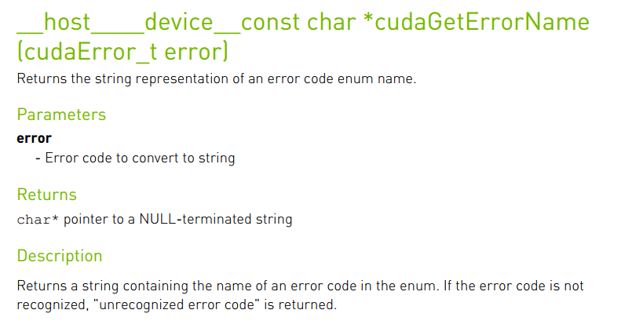
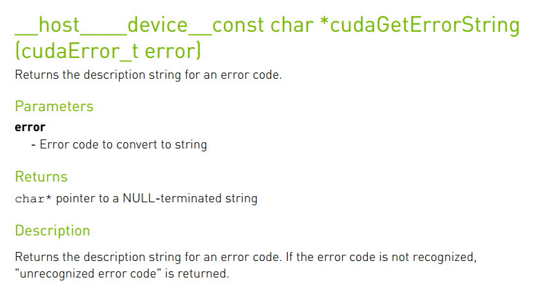
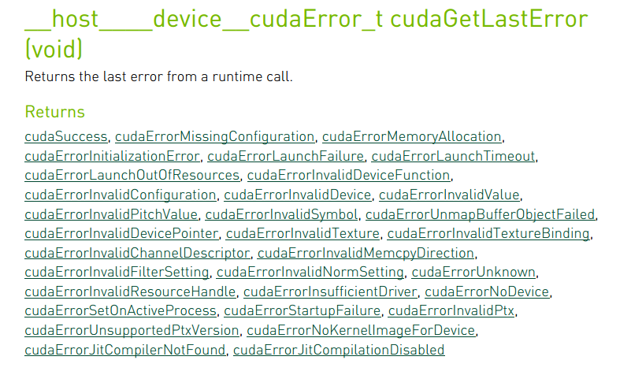

如果觉得文章及课程对您的学习起到帮助作用，请 ***Star*** 我的[github仓库](https://github.com/sangyc10/CUDA-code) ，并***关注***我的[B站频道](https://www.bilibili.com/video/BV1sM4y1x7of/):muscle::muscle::muscle:
>作为程序开发人员，想必都经历过调试代码的痛苦，编写***CUDA***程序难免会遇到各种各样的错误。如果代码的错误能够在编译的时候就被编译器捕捉，那么就要恭喜自己，这种编译错误是比较容易排查的，但是有一些错误在编译期间不能被捕捉到，在程序运行时才会被发现，这种运行时错误才是最难排查的。
>
>本节主要探究运行时错误捕捉的问题，我们从**CUDA**运行时**API**函数的错误代码返回值讲起，详细介绍如何捕捉**CUDA**代码运行时刻错误的方法。

# 一、运行时API错误代码

**CUDA**运行时**API**大多支持返回错误代码，返回值类型为**cudaError_t**，前面的例子我们也已经讲解过，**CUDA**运行时**API**成功执行，返回的错误代码为**cudaSuccess**，运行时**API**返回的执行状态值是枚举变量。

下图展示了部分**CUDA**运行时**API**错误代码的枚举变量：



# 二、错误检查函数

上一节课，我们讲解了一些内存管理和**GPU**设置的**CUDA**运行时**API**函数，回忆一下，包括设备内存分配函数**cudaMalloc**、获取**GPU**数量的函数**cudaGetDeviceCount**。每一个函数都有类型为**cudaError_t**的返回值，返回一个枚举变量的错误代码。

## 1、涉及的运行时API函数介绍

（1）获取错误代码对应名称—**cudaGetErrorName**

文档说明：



作用：

返回错误代码对应的名称，\_\_**host**\_\_和\_\_**device**\_\_代表该运行时**API**可以运行在主机，也可以运行在设备。这个运行时**API**函数与前面我们介绍的都不一样，它的返回值是**char \***，返回一个字符串，传入的参数是**cudaError_t**类型的错误代码。比如我们假设函数返回的错误代码为**1**，运行**cudaGetErrorName**函数将返回字符串“**cudaErrorInvalidValue**”。

（2）获取错误代码描述信息—**cudaGetErrorString**

文档说明：



作用：

返回错误代码对应的描述信息，同**cudaGetErrorName**，\_\_**host**\_\_和\_\_**device**\_\_代表该运行时**API**可以运行在主机，也可以运行在设备。它的返回值是**char \***，返回一个字符串，传入的参数是**cudaError_t**类型的错误代码。比如我们假设函数返回的错误代码为**1**，运行**cudaGetErrorName**函数将返回字符串“**invalid argument**”。

## 2、代码解析

我们把错误检测函数定义在命名为**tools/common.cuh**的文件中，今后所有通用工具类的代码，我们都会放在这个文件内，代码展示：

```cpp
#pragma once
#include <stdlib.h>
#include <stdio.h>

cudaError_t ErrorCheck(cudaError_t error_code, const char* filename, int lineNumber)
{
    if (error_code != cudaSuccess)
    {
        printf("CUDA error:\r\ncode=%d, name=%s, description=%s\r\nfile=%s, line%d\r\n",
                error_code, cudaGetErrorName(error_code), cudaGetErrorString(error_code), filename, lineNumber);
        return error_code;
    }
    return error_code;
}
```
调用错误检测函数：
```cpp
cudaError_t error = ErrorCheck(cudaSetDevice(iDev), __FILE__, __LINE__);
```
解析：

1. 预处理指令#**pragma once**确保当前文件在一个编译单元不被重复包含**CUDA**。
2. 调用错误检查函数时，**ErrorCheck**函数的第一个参数是可以返回错误代码的**CUDA**运行时**API**函数，\_\_**FILE**\_\_和\_\_**LINE**\_\_是**cpp**预先定义的标识符，\_\_**FILE**\_\_用于指示本行语句所在源文件的文件名，\_\_**LINE**\_\_用于指示本行语句在源文件中的位置信息。
3. 代码中**if**语句是用来判断待检测的运行时**API**函数是否发生错误，**error_code==cudaSuccess**则代表待检测的运行时**API**函数没有发生错误。只有发生错误时才会打印错误信息，报告错误代码、错误代码名字，错误代码文字描述、所在文件名字和发生错误行数。
4. 错误代码函数会返回待检测运行时**API**函数的**cudaError_t**类型的错误代码。

## 2、实例演示

这是一个运行时API函数有书写错误的代码，用于错误检测函数检测实验。代码的第**24**行，**cudaMemcpy**函数用于主机向设备拷贝数据，**kind**参数应该设置为**cudaMemcpyHostToDevice**，但是我故意将**kind**参数设置成**cudaMemcpyDeviceToHost**，数据传输方向有误。

```cpp
/*********************************************************************************************
 * file name  : errorCheckFunction.cu
 * author     : 权 双
 * date       : 2023-08-04
 * brief      : 错误检查函数的使用例子
***********************************************************************************************/

#include <stdio.h>
#include "../tools/common.cuh"


int main(void)
{
    // 1、分配主机内存，并初始化
    float *fpHost_A;
    fpHost_A = (float *)malloc(4);
    memset(fpHost_A, 0, 4);  // 主机内存初始化为0
    
    float *fpDevice_A;
    cudaError_t error = ErrorCheck(cudaMalloc((float**)&fpDevice_A, 4), __FILE__, __LINE__);
    cudaMemset(fpDevice_A, 0, 4);  // 设备内存初始化为0

    // 2、数据从主机复制到设备
    ErrorCheck(cudaMemcpy(fpDevice_A, fpHost_A, 4, cudaMemcpyDeviceToHost), __FILE__, __LINE__); 
    
    // 3、释放主机与设备内存
    free(fpHost_A);  
    ErrorCheck(cudaFree(fpDevice_A), __FILE__, __LINE__);
    
    ErrorCheck(cudaDeviceReset(), __FILE__, __LINE__);
    return 0;
}
```

运行结果：

CUDA error:  
code=1, name=cudaErrorInvalidValue, description=invalid argument  
file=errorCheckFunction.cu, line24  

# 三、检查核函数

错误检查函数无法捕捉调用核函数时发生的相关错误，前面也讲到过，核函数的返回值类型时**void**，即核函数不返回任何值。可以通过在调用核函数之后调用**cudaGetLastError()**函数捕捉核函数错误。

## 1、涉及的运行时API函数介绍

获取cuda程序的最后一个错误—**cudaGetLastError**

文档说明：



作用：

返回**CUDA**程序的最后一个错误，\_\_**host**\_\_和\_\_**device**\_\_代表该运行时**API**可以运行在主机，也可以运行在设备。这个运行时**API**函数返回**cudaError_t**类型的错误代码。

## 2、捕捉核函数错误方法

在调用核函数后，追加如下代码：

```cpp
ErrorCheck(cudaGetLastError(), __FILE__, __LINE__);
ErrorCheck(cudaDeviceSynchronize(), __FILE__, __LINE__);
```
说明：
1. 第一条语句作用是捕捉第二条同步函数之前的最后一个错误。
2. 第二条语句同步主机与设备，因为**CPU**和**GPU**是异构架构。

## 3、实例演示

这段代码在调用核函数时，设置的线程块线程数量为**2048**个（超过了线程块内线程数量最大值**1024**个），核函数不能被成功调用，代码会发生错误，用于检查核函数的实验。

代码说明：

此代码是数组相加代码，在第**98**行，将线程块大小设置为**2048**，第**101**行执行调用核函数语句，因超出线程块的最大值会导致核函数调用失败，第**102**行捕捉截至第**103**行之前的最后一条错误。

```cpp
/*********************************************************************************************
 * file name  : errorCheckKernel.cu
 * author     : 权 双
 * date       : 2023-08-05 
 * brief      : 捕捉核函数错误
***********************************************************************************************/

#include <stdio.h>
#include "../tools/common.cuh"

__device__ float add(const float x, const float y)
{
    return x + y;
}

__global__ void addFromGPU(float *A, float *B, float *C, const int N)
{
    const int bid = blockIdx.x;
    const int tid = threadIdx.x;
    const int id = tid + bid * blockDim.x; 

    if (id >= N) return;
    C[id] = add(A[id], B[id]);
    
}


void initialData(float *addr, int elemCount)
{
    for (int i = 0; i < elemCount; i++)
    {
        addr[i] = (float)(rand() & 0xFF) / 10.f;
    }
    return;
}


int main(void)
{
    // 1、设置GPU设备
    setGPU();

    // 2、分配主机内存和设备内存，并初始化
    int iElemCount = 4096;                     // 设置元素数量
    size_t stBytesCount = iElemCount * sizeof(float); // 字节数
    
    // （1）分配主机内存，并初始化
    float *fpHost_A, *fpHost_B, *fpHost_C;
    fpHost_A = (float *)malloc(stBytesCount);
    fpHost_B = (float *)malloc(stBytesCount);
    fpHost_C = (float *)malloc(stBytesCount);
    if (fpHost_A != NULL && fpHost_B != NULL && fpHost_C != NULL)
    {
        memset(fpHost_A, 0, stBytesCount);  // 主机内存初始化为0
        memset(fpHost_B, 0, stBytesCount);
        memset(fpHost_C, 0, stBytesCount);
    
    }
    else
    {
        printf("Fail to allocate host memory!\n");
        exit(-1);
    }


    // （2）分配设备内存，并初始化
    float *fpDevice_A, *fpDevice_B, *fpDevice_C;
    cudaMalloc((float**)&fpDevice_A, stBytesCount);
    cudaMalloc((float**)&fpDevice_B, stBytesCount);
    cudaMalloc((float**)&fpDevice_C, stBytesCount);
    if (fpDevice_A != NULL && fpDevice_B != NULL && fpDevice_C != NULL)
    {
        cudaMemset(fpDevice_A, 0, stBytesCount);  // 设备内存初始化为0
        cudaMemset(fpDevice_B, 0, stBytesCount);
        cudaMemset(fpDevice_C, 0, stBytesCount);
    }
    else
    {
        printf("fail to allocate memory\n");
        free(fpHost_A);
        free(fpHost_B);
        free(fpHost_C);
        exit(-1);
    }

    // 3、初始化主机中数据
    srand(666); // 设置随机种子
    initialData(fpHost_A, iElemCount);
    initialData(fpHost_B, iElemCount);
    
    // 4、数据从主机复制到设备
    cudaMemcpy(fpDevice_A, fpHost_A, stBytesCount, cudaMemcpyHostToDevice); 
    cudaMemcpy(fpDevice_B, fpHost_B, stBytesCount, cudaMemcpyHostToDevice); 
    cudaMemcpy(fpDevice_C, fpHost_C, stBytesCount, cudaMemcpyHostToDevice);


    // 5、调用核函数在设备中进行计算
    dim3 block(2048);
    dim3 grid((iElemCount + block.x - 1) / 2048); 

    addFromGPU<<<grid, block>>>(fpDevice_A, fpDevice_B, fpDevice_C, iElemCount);    // 调用核函数
    ErrorCheck(cudaGetLastError(), __FILE__, __LINE__);
    ErrorCheck(cudaDeviceSynchronize(), __FILE__, __LINE__);


    // 6、将计算得到的数据从设备传给主机
    cudaMemcpy(fpHost_C, fpDevice_C, stBytesCount, cudaMemcpyDeviceToHost);
  

    for (int i = 0; i < 10; i++)    // 打印
    {
        printf("idx=%2d\tmatrix_A:%.2f\tmatrix_B:%.2f\tresult=%.2f\n", i+1, fpHost_A[i], fpHost_B[i], fpHost_C[i]);
    }

    // 7、释放主机与设备内存
    free(fpHost_A);
    free(fpHost_B);
    free(fpHost_C);
    cudaFree(fpDevice_A);
    cudaFree(fpDevice_B);
    cudaFree(fpDevice_C);

    cudaDeviceReset();
    return 0;
}
```

执行结果：

The count of GPUs is 1.set GPU 0 for computing.  
***CUDA error:***  
***code=9, name=cudaErrorInvalidConfiguration, description=invalid configurationargument***  
***file=errorCheckKernel.cu, line102***  
idx= 1  matrix_A:0.90   matrix_B:10.90  result=0.00  
idx= 2  matrix_A:19.00  matrix_B:4.00   result=0.00  
idx= 3  matrix_A:15.80  matrix_B:15.00  result=0.00  
idx= 4  matrix_A:5.00   matrix_B:3.30   result=0.00  
idx= 5  matrix_A:11.10  matrix_B:4.20   result=0.00  
idx= 6  matrix_A:23.50  matrix_B:18.60  result=0.00  
idx= 7  matrix_A:20.90  matrix_B:4.50   result=0.00  
idx= 8  matrix_A:23.40  matrix_B:17.70  result=0.00  
idx= 9  matrix_A:16.90  matrix_B:18.40  result=0.00  
idx=10  matrix_A:7.30   matrix_B:18.30  result=0.00  

说明：

看斜体加粗部分，成功捕捉到错误。

>好了，今天的内容就讲到这里，我会继续更新相关内容哦！！:muscle::muscle::muscle:
