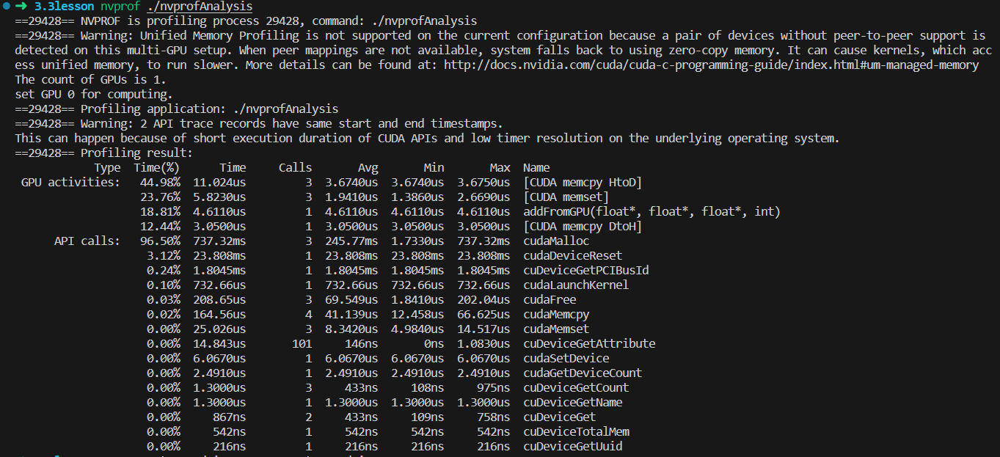

如果觉得文章及课程对您的学习起到帮助作用，请 ***Star*** 我的[github仓库](https://github.com/sangyc10/CUDA-code) ，并***关注***我的[B站频道](https://www.bilibili.com/video/BV1sM4y1x7of/):muscle::muscle::muscle:

>作为程序开发人员，通常情况下不仅要关注程序的正确性，还要关注程序的性能（即执行速度）。了解核函数的执行需要多长时间是很有必要的，想要掌握程序的性能，就需要对程序进行精确的记时。
>
>本节主要使用**CUDA**提供的事件记时方式来给一段**CUDA**代码记时。

# 一、事件记时

## 1、记时代码解析

> **CUDA**事件记时代码如下，只需要将需要记时的代码嵌入记时代码之间：

```cpp
cudaEvent_t start, stop;
ErrorCheck(cudaEventCreate(&start), __FILE__, __LINE__);
ErrorCheck(cudaEventCreate(&stop), __FILE__, __LINE__);
ErrorCheck(cudaEventRecord(start), __FILE__, __LINE__);
cudaEventQuery(start);	//此处不可用错误检测函数

/************************************************************
需要记时间的代码
************************************************************/

ErrorCheck(cudaEventRecord(stop), __FILE__, __LINE__);
ErrorCheck(cudaEventSynchronize(stop), __FILE__, __LINE__);
float elapsed_time;
ErrorCheck(cudaEventElapsedTime(&elapsed_time, start, stop), __FILE__, __LINE__);
printf("Time = %g ms.\n", elapsed_time);

ErrorCheck(cudaEventDestroy(start), __FILE__, __LINE__);
ErrorCheck(cudaEventDestroy(stop), __FILE__, __LINE__);
```

代码解析：

1. 第1行**cudaEvent_t start, stop：**定义两个**CUDA**事件类型（**cudaEvent_t**）的变量；
2. 第2、3行**cudaEventCreate**函数初始化定义的**cudaEvent_t**变量；
3. 第4行通过**cudaEventRecord**函数，在需要记时的代码块之前记录代表时间开始的事件；
4. 第5行**cudaEventQuery**函数在**TCC**驱动模式的**GPU**下可省略，但在处于**WDDM**驱动模式的**GPU**必须保留，因此，我们就一直保留这句函数即可。注意：**cudaEventQuery**函数不可使用错误检测函数；
5. 第8行是需要记时的代码块；
6. 第11行在需要记时的代码块之后记录代表时间结束的事件；
7. 第12行**cudaEventSynchronize**函数作用是让主机等待事件**stop**被记录完毕；
8. 第13~15行**cudaEventElapsedTime**函数的调用作用是计算**cudaEvent_t**变量**start**和**stop**时间差，记录在**float**变量**elapsed_time**中，并输出打印到屏幕上；
9. 第17、18行调用**cudaEventDestroy**函数销毁**start**和**stop**这两个类型为**cudaEvent_t**的**CUDA**事件。

## 2、核函数记时实例演示

> 此代码计算运行核函数10次的平均时间，核函数实际运行**11**次，由于第一次调用核函数，往往会花费更多的时间，如果将第一次记录进去，可能导致记录的时间不准确，因此忽略第一次调用核函数的时间，取**10**次平均值。

```cpp
/*********************************************************************************************
 * file name  : eventRecordTime.cu
 * author     : 权 双
 * date       : 2023-08-05
 * brief      : 核函数记时
***********************************************************************************************/

#include <stdio.h>
#include "../tools/common.cuh"

#define NUM_REPEATS 10

__device__ float add(const float x, const float y)
{
    return x + y;
}

__global__ void addFromGPU(float *A, float *B, float *C, const int N)
{
    const int bid = blockIdx.x;
    const int tid = threadIdx.x;
    const int id = tid + bid * blockDim.x; 
    if (id >= N) return;
    C[id] = add(A[id], B[id]);
    
}


void initialData(float *addr, int elemCount)
{
    for (int i = 0; i < elemCount; i++)
    {
        addr[i] = (float)(rand() & 0xFF) / 10.f;
    }
    return;
}


int main(void)
{
    // 1、设置GPU设备
    setGPU();

    // 2、分配主机内存和设备内存，并初始化
    int iElemCount = 4096;                     // 设置元素数量
    size_t stBytesCount = iElemCount * sizeof(float); // 字节数
    
    // （1）分配主机内存，并初始化
    float *fpHost_A, *fpHost_B, *fpHost_C;
    fpHost_A = (float *)malloc(stBytesCount);
    fpHost_B = (float *)malloc(stBytesCount);
    fpHost_C = (float *)malloc(stBytesCount);
    if (fpHost_A != NULL && fpHost_B != NULL && fpHost_C != NULL)
    {
        memset(fpHost_A, 0, stBytesCount);  // 主机内存初始化为0
        memset(fpHost_B, 0, stBytesCount);
        memset(fpHost_C, 0, stBytesCount);
    
    }
    else
    {
        printf("Fail to allocate host memory!\n");
        exit(-1);
    }


    // （2）分配设备内存，并初始化
    float *fpDevice_A, *fpDevice_B, *fpDevice_C;
    ErrorCheck(cudaMalloc((float**)&fpDevice_A, stBytesCount), __FILE__, __LINE__);
    ErrorCheck(cudaMalloc((float**)&fpDevice_B, stBytesCount), __FILE__, __LINE__);
    ErrorCheck(cudaMalloc((float**)&fpDevice_C, stBytesCount), __FILE__, __LINE__);
    if (fpDevice_A != NULL && fpDevice_B != NULL && fpDevice_C != NULL)
    {
        ErrorCheck(cudaMemset(fpDevice_A, 0, stBytesCount), __FILE__, __LINE__); // 设备内存初始化为0
        ErrorCheck(cudaMemset(fpDevice_B, 0, stBytesCount), __FILE__, __LINE__);
        ErrorCheck(cudaMemset(fpDevice_C, 0, stBytesCount), __FILE__, __LINE__);
    }
    else
    {
        printf("fail to allocate memory\n");
        free(fpHost_A);
        free(fpHost_B);
        free(fpHost_C);
        exit(-1);
    }

    // 3、初始化主机中数据
    srand(666); // 设置随机种子
    initialData(fpHost_A, iElemCount);
    initialData(fpHost_B, iElemCount);
    
    // 4、数据从主机复制到设备
    ErrorCheck(cudaMemcpy(fpDevice_A, fpHost_A, stBytesCount, cudaMemcpyHostToDevice), __FILE__, __LINE__); 
    ErrorCheck(cudaMemcpy(fpDevice_B, fpHost_B, stBytesCount, cudaMemcpyHostToDevice), __FILE__, __LINE__);
    ErrorCheck(cudaMemcpy(fpDevice_C, fpHost_C, stBytesCount, cudaMemcpyHostToDevice), __FILE__, __LINE__);


    // 5、调用核函数在设备中进行计算
    dim3 block(32);
    dim3 grid((iElemCount + block.x - 1) / 32);

    float t_sum = 0;
    for (int repeat = 0; repeat <= NUM_REPEATS; ++repeat)
    {
        cudaEvent_t start, stop;
        ErrorCheck(cudaEventCreate(&start), __FILE__, __LINE__);
        ErrorCheck(cudaEventCreate(&stop), __FILE__, __LINE__);
        ErrorCheck(cudaEventRecord(start), __FILE__, __LINE__);
        cudaEventQuery(start);	//此处不可用错误检测函数

        addFromGPU<<<grid, block>>>(fpDevice_A, fpDevice_B, fpDevice_C, iElemCount);    // 调用核函数

        ErrorCheck(cudaEventRecord(stop), __FILE__, __LINE__);
        ErrorCheck(cudaEventSynchronize(stop), __FILE__, __LINE__);
        float elapsed_time;
        ErrorCheck(cudaEventElapsedTime(&elapsed_time, start, stop), __FILE__, __LINE__);
        // printf("Time = %g ms.\n", elapsed_time);

        if (repeat > 0)
        {
            t_sum += elapsed_time;
        }

        ErrorCheck(cudaEventDestroy(start), __FILE__, __LINE__);
        ErrorCheck(cudaEventDestroy(stop), __FILE__, __LINE__);
    }

    const float t_ave = t_sum / NUM_REPEATS;
    printf("Time = %g ms.\n", t_ave);

    // 6、将计算得到的数据从设备传给主机
    ErrorCheck(cudaMemcpy(fpHost_C, fpDevice_C, stBytesCount, cudaMemcpyDeviceToHost), __FILE__, __LINE__);

    // 7、释放主机与设备内存
    free(fpHost_A);
    free(fpHost_B);
    free(fpHost_C);
    ErrorCheck(cudaFree(fpDevice_A), __FILE__, __LINE__);
    ErrorCheck(cudaFree(fpDevice_B), __FILE__, __LINE__);
    ErrorCheck(cudaFree(fpDevice_C), __FILE__, __LINE__);

    ErrorCheck(cudaDeviceReset(), __FILE__, __LINE__);
    return 0;
}
```

对第103~129行代码进行说明：

1. 第111行为调用核函数代码，它包含在我们前文所描述的记录时间代码之间；
2. 第119~122行，作用是计算除了第一次调用核函数的时间外，其它**10**次调用核函数的时间和；
3. 第128、129行，计算**10**次调用核函数平均值，并打印输出。

# 二、nvprof性能刨析

## 1、nvprof工具说明

> **CUDA** **5.0**后有一个工具叫做**nvprof**的命令行分析工具，**nvprof**是一个可执行文件。
>
> 如下执行命令语句，其中**exe_name**为可执行文件的名字。

```bash
nvprof ./exe_name
```

## 2、nvprof实例演示

代码如下：

```cpp
/*********************************************************************************************
 * file name  : nvprofAnalysis.cu
 * author     : 权 双
 * date       : 2023-08-12
 * brief      : nvprof性能分析
***********************************************************************************************/

#include <stdio.h>
#include "../tools/common.cuh"

#define NUM_REPEATS 10

__device__ float add(const float x, const float y)
{
    return x + y;
}

__global__ void addFromGPU(float *A, float *B, float *C, const int N)
{
    const int bid = blockIdx.x;
    const int tid = threadIdx.x;
    const int id = tid + bid * blockDim.x; 
    if (id >= N) return;
    C[id] = add(A[id], B[id]);
    
}


void initialData(float *addr, int elemCount)
{
    for (int i = 0; i < elemCount; i++)
    {
        addr[i] = (float)(rand() & 0xFF) / 10.f;
    }
    return;
}


int main(void)
{
    // 1、设置GPU设备
    setGPU();

    // 2、分配主机内存和设备内存，并初始化
    int iElemCount = 4096;                     // 设置元素数量
    size_t stBytesCount = iElemCount * sizeof(float); // 字节数
    
    // （1）分配主机内存，并初始化
    float *fpHost_A, *fpHost_B, *fpHost_C;
    fpHost_A = (float *)malloc(stBytesCount);
    fpHost_B = (float *)malloc(stBytesCount);
    fpHost_C = (float *)malloc(stBytesCount);
    if (fpHost_A != NULL && fpHost_B != NULL && fpHost_C != NULL)
    {
        memset(fpHost_A, 0, stBytesCount);  // 主机内存初始化为0
        memset(fpHost_B, 0, stBytesCount);
        memset(fpHost_C, 0, stBytesCount);
    
    }
    else
    {
        printf("Fail to allocate host memory!\n");
        exit(-1);
    }


    // （2）分配设备内存，并初始化
    float *fpDevice_A, *fpDevice_B, *fpDevice_C;
    ErrorCheck(cudaMalloc((float**)&fpDevice_A, stBytesCount), __FILE__, __LINE__);
    ErrorCheck(cudaMalloc((float**)&fpDevice_B, stBytesCount), __FILE__, __LINE__);
    ErrorCheck(cudaMalloc((float**)&fpDevice_C, stBytesCount), __FILE__, __LINE__);
    if (fpDevice_A != NULL && fpDevice_B != NULL && fpDevice_C != NULL)
    {
        ErrorCheck(cudaMemset(fpDevice_A, 0, stBytesCount), __FILE__, __LINE__); // 设备内存初始化为0
        ErrorCheck(cudaMemset(fpDevice_B, 0, stBytesCount), __FILE__, __LINE__);
        ErrorCheck(cudaMemset(fpDevice_C, 0, stBytesCount), __FILE__, __LINE__);
    }
    else
    {
        printf("fail to allocate memory\n");
        free(fpHost_A);
        free(fpHost_B);
        free(fpHost_C);
        exit(-1);
    }

    // 3、初始化主机中数据
    srand(666); // 设置随机种子
    initialData(fpHost_A, iElemCount);
    initialData(fpHost_B, iElemCount);
    
    // 4、数据从主机复制到设备
    ErrorCheck(cudaMemcpy(fpDevice_A, fpHost_A, stBytesCount, cudaMemcpyHostToDevice), __FILE__, __LINE__); 
    ErrorCheck(cudaMemcpy(fpDevice_B, fpHost_B, stBytesCount, cudaMemcpyHostToDevice), __FILE__, __LINE__);
    ErrorCheck(cudaMemcpy(fpDevice_C, fpHost_C, stBytesCount, cudaMemcpyHostToDevice), __FILE__, __LINE__);


    // 5、调用核函数在设备中进行计算
    dim3 block(32);
    dim3 grid((iElemCount + block.x - 1) / 32);

    addFromGPU<<<grid, block>>>(fpDevice_A, fpDevice_B, fpDevice_C, iElemCount);    // 调用核函数

    // 6、将计算得到的数据从设备传给主机
    ErrorCheck(cudaMemcpy(fpHost_C, fpDevice_C, stBytesCount, cudaMemcpyDeviceToHost), __FILE__, __LINE__);

    // 7、释放主机与设备内存
    free(fpHost_A);
    free(fpHost_B);
    free(fpHost_C);
    ErrorCheck(cudaFree(fpDevice_A), __FILE__, __LINE__);
    ErrorCheck(cudaFree(fpDevice_B), __FILE__, __LINE__);
    ErrorCheck(cudaFree(fpDevice_C), __FILE__, __LINE__);

    ErrorCheck(cudaDeviceReset(), __FILE__, __LINE__);
    return 0;
}
```

假定生成可执行文件为**nvprofAnalysis**，执行：

```bash
nvprof ./nvprofAnalysis
```

执行结果：



主要看**GPU activities**：

1. [CUDA memcpy HtoD]：主机向设备拷贝数据花费时间占比44.98%；
2. [CUDA memset]：设备调用cudaMemset函数初始化数据占用时间占比23.76%；
3. 核函数执行占比为18.81%；
4. [CUDA memcpy DtoH]：设备向主机拷贝数据花费时间占比12.14%；

>好了，今天的内容就讲到这里，我会继续更新相关内容哦！！:muscle::muscle::muscle: