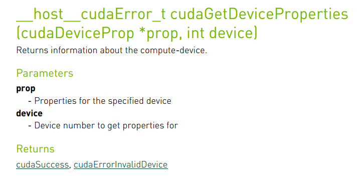
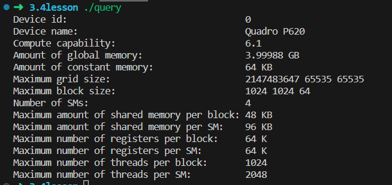
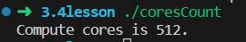

如果觉得文章及课程对您的学习起到帮助作用，请 ***Star*** 我的[github仓库](https://github.com/sangyc10/CUDA-code) ，并***关注***我的[B站频道](https://www.bilibili.com/video/BV1sM4y1x7of/):muscle::muscle::muscle:

>本节介绍如何使用CUDA运行时API函数查询GPU设备信息，以及根据GPU计算能力计算出GPU的核心数量。

# 一、运行时API查询GPU信息

## 1、涉及的运行时API函数介绍

下图为获取**GPU**运行时信息的**CUDA**运行时**API**函数：



作用：

1. 参数传入：1、事先定义的**cudaDeviceProf**类型的变量 2、计算机**GPU**的索引号；
2. 该函数只能在主机中调用；

## 2、实例演示

> 通过调用**cudaGetDeviceProperties**运行时**API**打印设备信息：

```cpp
/*********************************************************************************************
 * file name  : query.cu
 * author     : 权 双
 * date       : 2023-08-13
 * brief      : 运行时API查询GPU信息
***********************************************************************************************/

#include "../tools/common.cuh"
#include <stdio.h>

int main(void)
{
    int device_id = 0;
    ErrorCheck(cudaSetDevice(device_id), __FILE__, __LINE__);

    cudaDeviceProp prop;
    ErrorCheck(cudaGetDeviceProperties(&prop, device_id), __FILE__, __LINE__);

    printf("Device id:                                 %d\n",
        device_id);
    printf("Device name:                               %s\n",
        prop.name);
    printf("Compute capability:                        %d.%d\n",
        prop.major, prop.minor);
    printf("Amount of global memory:                   %g GB\n",
        prop.totalGlobalMem / (1024.0 * 1024 * 1024));
    printf("Amount of constant memory:                 %g KB\n",
        prop.totalConstMem  / 1024.0);
    printf("Maximum grid size:                         %d %d %d\n",
        prop.maxGridSize[0], 
        prop.maxGridSize[1], prop.maxGridSize[2]);
    printf("Maximum block size:                        %d %d %d\n",
        prop.maxThreadsDim[0], prop.maxThreadsDim[1], 
        prop.maxThreadsDim[2]);
    printf("Number of SMs:                             %d\n",
        prop.multiProcessorCount);
    printf("Maximum amount of shared memory per block: %g KB\n",
        prop.sharedMemPerBlock / 1024.0);
    printf("Maximum amount of shared memory per SM:    %g KB\n",
        prop.sharedMemPerMultiprocessor / 1024.0);
    printf("Maximum number of registers per block:     %d K\n",
        prop.regsPerBlock / 1024);
    printf("Maximum number of registers per SM:        %d K\n",
        prop.regsPerMultiprocessor / 1024);
    printf("Maximum number of threads per block:       %d\n",
        prop.maxThreadsPerBlock);
    printf("Maximum number of threads per SM:          %d\n",
        prop.maxThreadsPerMultiProcessor);

    return 0;
}
```

输出：



说明：

1. Device id:  计算机中GPU的设备代号，我只有一个显卡，所以只能是0；
2. Device name:  显卡名字，我的显卡是Quadro P620；
3. Compute capability: GPU计算能力，我的主版本是6，次版本是1；
4. Amount of global memory: 显卡显存大小，我的是4G的显存；
5. Amount of constant memory: 常量内存大小；
6. Maximum grid size:  最大网格大小（三个维度分别的最大值）；
7. Maximum block size:   最大线程块大小（三个维度分别的最大值）；
8. Number of SMs:  流多处理器数量；
9. Maximum amount of shared memory per block:  每个线程块最大共享内存数量；
10. Maximum amount of shared memory per SM:  每个流多处理器最大共享内存数量；
11. Maximum number of registers per block:  每个线程块最大寄存器内存数量；
12. Maximum number of registers per SM: 每个流多处理器最大寄存器内存数量；
13. Maximum number of threads per block:  每个线程块最大的线程数量；
14. Maximum number of threads per SM:   每个流多处理器最大的线程数量。

# 二、查询GPU计算核心数量

CUDA运行时API函数是无法查询GPU的核心数量的（起码我不知道要用哪一个运行时API函数），不过我在论坛上找到了怎么根据GPU架构计算核心数量的方法了，直接上代码：

代码如下：

```cpp
/*********************************************************************************************
 * file name  : coresCount.cu
 * author     : 权 双
 * date       : 2023-08-13
 * brief      : 查询GPU计算核心数量
**********************************************************************************************/

#include <stdio.h>
#include "../tools/common.cuh"

int getSPcores(cudaDeviceProp devProp)
{  
    int cores = 0;
    int mp = devProp.multiProcessorCount;
    switch (devProp.major){
     case 2: // Fermi
      if (devProp.minor == 1) cores = mp * 48;
      else cores = mp * 32;
      break;
     case 3: // Kepler
      cores = mp * 192;
      break;
     case 5: // Maxwell
      cores = mp * 128;
      break;
     case 6: // Pascal
      if ((devProp.minor == 1) || (devProp.minor == 2)) cores = mp * 128;
      else if (devProp.minor == 0) cores = mp * 64;
      else printf("Unknown device type\n");
      break;
     case 7: // Volta and Turing
      if ((devProp.minor == 0) || (devProp.minor == 5)) cores = mp * 64;
      else printf("Unknown device type\n");
      break;
     case 8: // Ampere
      if (devProp.minor == 0) cores = mp * 64;
      else if (devProp.minor == 6) cores = mp * 128;
      else if (devProp.minor == 9) cores = mp * 128; // ada lovelace
      else printf("Unknown device type\n");
      break;
     case 9: // Hopper
      if (devProp.minor == 0) cores = mp * 128;
      else printf("Unknown device type\n");
      break;
     default:
      printf("Unknown device type\n"); 
      break;
      }
    return cores;
}

int main()
{
    int device_id = 0;
    ErrorCheck(cudaSetDevice(device_id), __FILE__, __LINE__);
    

    cudaDeviceProp prop;
    ErrorCheck(cudaGetDeviceProperties(&prop, device_id), __FILE__, __LINE__);

    printf("Compute cores is %d.\n", getSPcores(prop));

    return 0;
}
```

执行结果：



>好了，今天的内容就讲到这里，我会继续更新相关内容哦！！:muscle::muscle::muscle: